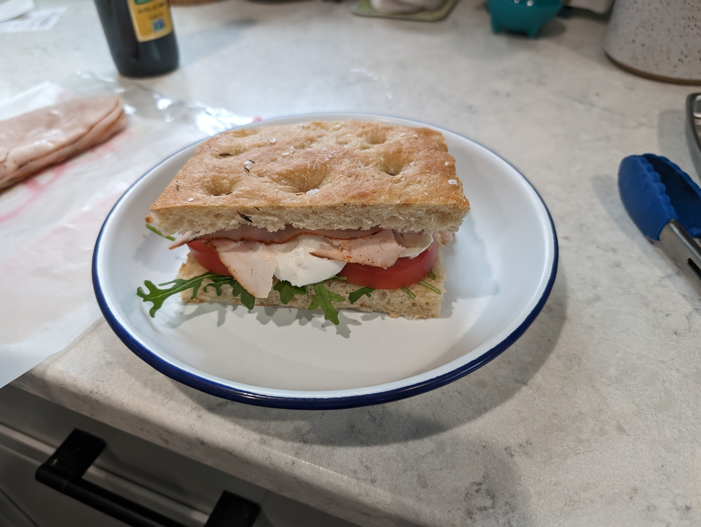

From [King Arthur](https://www.kingarthurbaking.com/recipes/sourdough-focaccia-recipe)

- Had a tough time scraping it from the sides of the pan. Used a pie spatula and let it cool more and then it was ok.
- Put sliced garlic on half, thyme on the whole thing, boss salt crystals. Garlic mostly dehydrated. Will mince instead next time, probs.
- A good deal of the toppings fell off when sliced down the middle and then inverted to toast. Maybe olive oil will help them stick (or I just won't flip it).

# Results
- Good! A little more dense than I expected.
- Sliced and froze 1/2 loaf or so
- Next time will probably brush with olive oil after it comes out of the oven
- Can't really taste the sourdough, but the flavor is good. Recipe uses commercial yeast anyhow, might skip the sourdough next time.

# Pics

Mixed: 

Bulk ferment:

- Looks pretty good. In fridge for cold ferment, 6:55pm.

Proofed:

Shaped:

Baked:

Crumb:

Sando!

